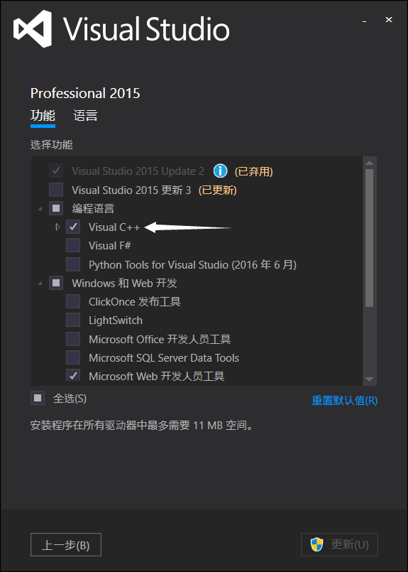
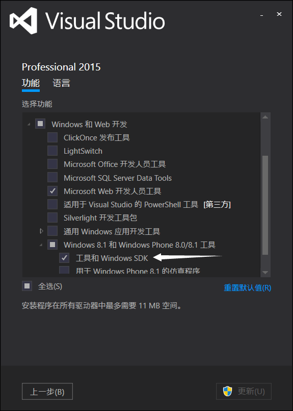
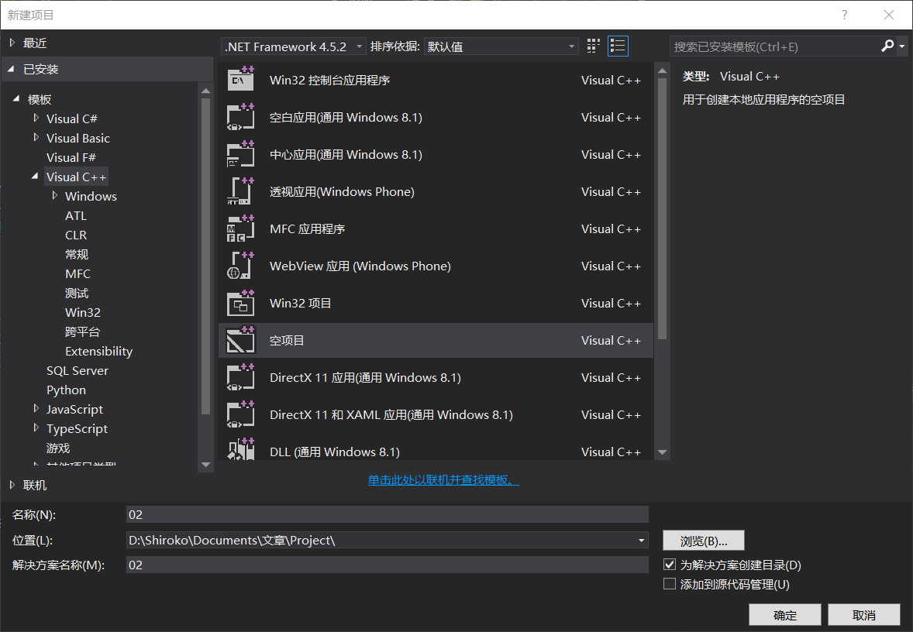
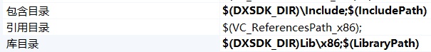
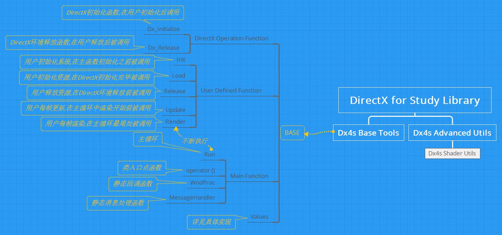

# DirectX*11*学习笔记[2]
Author: [*OyaKti(SRK)*](http://blog.qvq.moe/ "OyaKti的弱鸡心得")
Date: 2016/7/3-4
## DirectX开发环境的搭建,第一个DirectX程序以及框架封装
------
<!--more-->

[1.Visual Studio搭建](#1)
[2.DirectX开发环境搭建](#2)
[3.第一个DirectX程序](#3)
    [3-1.格式附录](#3.1)
[4.封装DirectX框架](#4)
    [4-1.框架结构](#4.1)
    [4-2.框架实现](#4.2)
[5.工程文件下载](#5)

* ## Visual Studio 2015开发环境搭建

    本文基于[**Vusial Studio 2015**](https://zh.wikipedia.org/wiki/Microsoft_Visual_Studio#Visual_Studio_2015)(下文简称Vs2015)进行开发,但Dx开发环境并非仅Vs2015,使用Vs2015对于新手是不合适的,推荐新手使用[**Visual Studio 2013**](https://zh.wikipedia.org/wiki/Microsoft_Visual_Studio#Visual_Studio_2013)进行开发学习.
    Vs2015的安装过程不加以过多阐述,组件选择必须勾选Visual C++以及Windows SDK.​ 
    安装完成后可适当安装插件进行辅助开发,诸如VSColorOutput,VAX等.

    [返回目录](#home)

* ## DirectX开发环境搭建
    下载[DXSDK_June11](http://download.microsoft.com/download/A/E/7/AE743F1F-632B-4809-87A9-AA1BB3458E31/DXSDK_Jun10.exe)并安装,安装项默认即可.若出现安装警告S1023,无视即可.定位到安装目录,检查是否存在Include和Lib文件.

    [返回目录](#home)

* ## 第一个DirectX程序
    使用Vs2015建立一个新的Visual C++ 空项目工程
    
    添加一个main.cpp文件.
    在使用DirectX之前,我们需要有一个空窗体来进行渲染.所以我们先利用Windows Api创建一个新窗体.Win32窗体程序的入口点是WinMain函数,其定义如下:
    `C++
    #include <Windows.h>

    int WINAPI wWinMain(HINSTANCE hInstance, HINSTANCE prevInstance, LPWSTR cmdLine, int cmdShow){
        return 0;
    }
    `
    虽说入口点是WinMain函数,但是我们却使用了wWinMain函数,这是因为wWinMain中的第一个w代表宽字符,也就是Unicode,使用wWinMain则可以正确处理传入的Unicode参数而不受WinMain的ANSI限制的制约.
    入口点的四个参数定义如下:
    hInstance: 应用程序当前实例的句柄.
    prevInstance: 应用程序前一个实例的句柄.
    cmdLind: 使用命令行传入的参数.
    cmdShow: 窗口的模式ID号码,例如最大化最小化或正常等.
    认识了入口函数,接下来就要进行窗口的初始化,受篇幅限制,我不对初始化代码进行过多的描述,若想了解更多有关Windows Api编程的细节,请参阅其他资料或书籍.
    以下是窗口初始化的代码:
    `C++
    int WINAPI wWinMain(HINSTANCE hInstance, HINSTANCE prevInstance, LPWSTR cmdLine, int cmdShow) {
        WNDCLASSEX wndClass = { 0 };  
        wndClass.cbSize = sizeof(WNDCLASSEX);   //结构体大小
        wndClass.style = CS_HREDRAW | CS_VREDRAW;  //窗口外观            wndClass.lpfnWndProc = WndProc;     //回调函数
        wndClass.hInstance = hInstance;     //当前实例句柄
        wndClass.hCursor = LoadCursor(NULL, IDC_ARROW);    //指针
        wndClass.hbrBackground = (HBRUSH)(COLOR_WINDOW + 1);    //背景笔刷句柄
        wndClass.lpszMenuName = NULL;  //菜单,不需要
        wndClass.lpszClassName = "Window";  //窗口类名
        if (!RegisterClassEx(&wndClass)) //注册并检查是否正确注册窗口类  
        		return -1;
        RECT rc = { 0, 0, 640, 480 };  //窗口大小
        AdjustWindowRect(&rc, WS_OVERLAPPEDWINDOW, false);  //计算窗口实际尺寸
        HWND hwnd = CreateWindow(   //创建一个窗口
            "Window", //窗口类名,与WNDCLASSEX中设置相同
            "Test", //窗口标题栏
            WS_OVERLAPPEDWINDOW, //窗口风格
            0, 0, //窗口位置
            rc.right - rc.left, //窗口宽度
            rc.bottom - rc.top, //窗口高度
            NULL, NULL, //窗口父句柄和菜单句柄
            hInstance, //窗口实例
            NULL//窗口过程处理数据
        );  
        if (!hwnd) return -1;   //判断是否成功创建
        ShowWindow(hwnd, cmdShow);  //显示窗口
        //下略
    }
    `
    这段代码初始化了一个窗口类(WNDCLASSEX)并且用RegisterClassEx注册了他,WNDCLASSEX的定义在微软的[官方API手册](https://technet.microsoft.com/zh-cn/library/ms633577.aspx)里有写,这里不过多阐述了.代码的解释已经在注释中对大多数语句进行了说明,如需获得更详细的解释请参阅Windows API手册或其他书籍资料等.
    创建完窗体,我们就要开始程序的主循环了,在任何Win32程序里,都必定会有主循环的参与,主循环是我们处理事务的地方,也是最主要的地方.我们接下来的任何操作,都是发生在主循环里的.下面就是主循环的程序代码:
    `C++
    #include <Windows.h>

    int WINAPI wWinMain(HINSTANCE hInstance, HINSTANCE prevInstance, LPWSTR cmdLine, int cmdShow) {
        //上略
        MSG msg = { 0 };    
        while (msg.message != WM_QUIT) {//判断窗体是否接收到退出消息
            if (PeekMessage(&msg, 0, 0, 0, PM_REMOVE)) {   //获取消息
                TranslateMessage(&msg);//翻译消息
			    DispatchMessage(&msg);//将消息传送给窗口过程处理
		    } else {
                //主循环处理,渲染更新检查操作等
	       }
	   }
	   return static_cast<int>(msg.wParam);//强制转换后返回
    }
    `
    这下wWinMain中所有的代码已经齐全了,但是编译还是不能够通过,对,我们还少一个窗口过程,处理消息的一个函数.下面是窗口过程WndProc的代码:
    `C++
    LRESULT CALLBACK WndProc(HWND hWnd, UINT msg, WPARAM wParam, LPARAM lParam) {
        PAINTSTRUCT ps;
	    HDC hDC;
	    switch (msg) {
	    case WM_PAINT://绘图事件
            hDC = BeginPaint(hWnd, &ps);
		    EndPaint(hWnd, &ps);
		    break;
	    case WM_DESTROY://窗口销毁事件
		    PostQuitMessage(0);//发送退出消息使主循环退出
		    break;
	    default:
		    return DefWindowProc(hWnd, msg, wParam, lParam);//调用默认行为处理消息
		    break;
	    }
	    return 0;
    }
    `
    以上就是创建一个窗口所涉及的所有代码,这里就不详细解释了.编译并运行所有代码,记得WndProc一定要在wWinMain前面进行声明.若无意外,将会有一个白色的窗口出现,这就是一个Win32窗体程序!
    仅仅是这样,还远远算不上DirectX程序,我们需要初始化DirectX的渲染环境.
    首先为我们的工程添加DirectX的库.
    在项目属性->VC++目录中,找到包含目录和库目录,将$(DXSDK_DIR)\Include和$(DXSDK_DIR)Lib\x86添加.如图所示
    然后在项目属性->连接器->输入->附加依赖项中,添加d3d11.lib;d3dx11.lib;dxerr.lib,然后执行编译,若无错误报告,则库配置成功.我们就可以开始初始化DirectX的渲染环境了.
    初始化D3D,总共分四个步骤:
        1. 定义设备类型和特征级别(DX版本)
        2. 创建D3D设备,渲染环境(d3dContext)和交换链(swapChain)
        3. 创建渲染对象
        4. 设置观察视口(Viewport)
    D3D11中我们可用的设备分为四种:硬件设备,软件设备,WARP设备和引用设备.硬件设备是直接利用图形硬件进行渲染,是最快的设备.软件设备是允许开发者自己编写渲染驱动并用于D3D中的设备.WARP设备是利用CPU高效渲染设备,可模拟D3D所有特性,通常用以补全硬件设备所不支持的特性而引用设备速度缓慢的情况.引用设备是利用CPU对图形硬件不支持的特性进行渲染的设备,效率低,用于没有其他替代设备时或新的DX版本发布时的情况.通常这四种设备的优先级由上到下分别为:硬件设备,WARP设备,引用设备,软件设备.D3D通过驱动类型数组进行自上而下的渲染尝试以获取最高性能和最佳效果.以下是设备类型和特征级别声明的代码:
    `C++
    D3D_DRIVER_TYPE DriverTypes[] = {
		D3D_DRIVER_TYPE_HARDWARE,
		D3D_DRIVER_TYPE_WARP,
		D3D_DRIVER_TYPE_REFERENCE,
		D3D_DRIVER_TYPE_SOFTWARE
	};

	D3D_FEATURE_LEVEL FeatureLevels[] = {
		//D3D_FEATURE_LEVEL_11_1,//DX11.1,使用该版本需要d3d11_1.h,不在本系列范围内
		D3D_FEATURE_LEVEL_11_0,//DX11.0
		D3D_FEATURE_LEVEL_10_1,//DX10.1
		D3D_FEATURE_LEVEL_10_0 //DX10.0
	};

	unsigned int SizeOfDriverTypes = ARRAYSIZE(DriverTypes);//获取总数
	unsigned int SizeOfFeatureLevels = ARRAYSIZE(FeatureLevels);//同上
    `
    使用该段代码应当包含d3d11.h文件.代码浅显易懂,不做其他解释.声明了这些是为了创建D3D设备时使用,但是在创建D3D设备前,需要先创建交换链([SwapChain](https://en.wikipedia.org/wiki/Swap_Chain).交换链是每个设备至少有一个用以存储各种缓存的事物.交换链的存在保证了帧率的稳定和执行的稳定,每一个交换链可以有两个缓存区,这种机制被称为双面缓存(或称乒乓缓存),第一面是主缓存(或称前向缓存,frame buffer),用以输出到显示卡以进行显示,第二面是后置缓存(或称后向缓存或辅助缓存,back buffer),用以进行绘图渲染的输出.双面缓存通过一个写入一个输出,不停循环(presentation or swapping)解决了帧率不稳定等的弊病,而后置缓存并非只能有一个,可以有多个后置缓存存在,更高效的进行渲染,不使用双面缓存也是被接受但是不被推荐.通常交换链被存储在显存中,不过内存也是可以很好的存储交换链的.以下代码演示了如何创建一个交换链描述符
    `C++
    DXGI_SWAP_CHAIN_DESC scd = { 0 };   //交换链描述符
	scd.BufferCount = 1;   //交换链缓存区数量
	scd.BufferDesc.Height = height;    //交换链缓存区大小
	scd.BufferDesc.Width = width;
	scd.BufferDesc.Format = DXGI_FORMAT_R8G8B8A8_UNORM;//缓存区格式,关于格式更多的信息请参阅3-1节
	scd.BufferDesc.RefreshRate.Numerator = 60;   //刷新率分子
	scd.BufferDesc.RefreshRate.Denominator = 1;    //刷新率分母,60hz
	scd.BufferUsage = DXGI_USAGE_RENDER_TARGET_OUTPUT;//缓存区用以渲染输出
	scd.OutputWindow = hwnd;//输出窗口句柄
	scd.Windowed = true;//是否窗口模式
	scd.SampleDesc.Count = 1;//取样数量
	scd.SampleDesc.Quality = 0;//取样质量
    `
    关于交换链描述符成员的更详细解释在[微软文档](https://msdn.microsoft.com/zh-cn/library/windows/desktop/bb173075.aspx)中,这里不过多阐述.
    交换链和渲染设备描述都已经齐全了,接下来就要创建D3D设备了.D3D设备用来与硬件进行通讯,以通知设备渲染的环境,状态等其他信息.下列代码一起创建了D3D设备,交换链和环境.
    `C++
    ID3D11Device *d3dDevice;    //D3D设备
	ID3D11DeviceContext *d3dContext;//D3D渲染环境(渲染上下文)
	IDXGISwapChain *swapChain;//交换链
	D3D_FEATURE_LEVEL featureLevel;//特征等级(版本)
	D3D_DRIVER_TYPE driverType;//设备类型

	HRESULT res;
	for (int i = 0; i < SizeOfDriverTypes; i++) {//依次遍历四个设备类型
		res = D3D11CreateDeviceAndSwapChain(//创建设备和交换链
			NULL,//指定显示卡,NULL为默认
			DriverTypes[i],//设备类型(依次遍历)
			NULL,//动态库句柄,若为软件设备,该值不能为NULL
			D3D11_CREATE_DEVICE_DEBUG,//创建标志,D3D11_CREATE_DEVICE_DEBUG提供可供调试的设备,若发布,则为0
			FeatureLevels,//特征级别
			SizeOfFeatureLevels,//特征级别数量
			D3D11_SDK_VERSION,//SDK版本号
			&scd,//交换链描述符
			&swapChain,//交换链
			&d3dDevice,//设备
			&featureLevel,//所选中的特征级别,位于特征级别数组中
			&d3dContext//渲染环境
		);
		if (SUCCEEDED(res)) {
			driverType = DriverTypes[i];
			break;
		}
	}
	if (FAILED(res))
		return -1;
    `
    以上代码运用函数D3D11CreateDeviceAndSwapChain同时创建了我们所需要的所有,这里我们就获得了进行渲染的设备,环境和交换链.初始化D3D.获取交换链后,我们需要创建一个渲染目标视图(Render Target View)提供给设备用来渲染.下面是创建渲染目标视图的代码.
    `C++
    ID3D11RenderTargetView *RTV;//渲染目标视图
	ID3D11Texture2D *backBuffer;//缓存
	res = swapChain->GetBuffer(
        0, //索引,0开始
        __uuidof(ID3D11Texture2D), //类型,2D贴图为ID3D11Texture2D
        (void**)&backBuffer//目标缓存地址,需要用void**或LPVOID强制类型转换
    );
	if (FAILED(res))
		return -1;
	res = d3dDevice->CreateRenderTargetView(
        backBuffer, //缓存2D贴图
        0, //渲染目标描述
        &RTV//渲染目标视图
    );
	if (backBuffer)
		backBuffer->Release();//释放以避免内存泄露
	if (FAILED(res))
		return -1;
    d3dContext->OMSetRenderTargets(1, &RTV, 0);//设置渲染目标为渲染目标视图,参数依次为视图数量,视图列表,深度/模板视图.
    `
    之所以缓存的类型是ID3D11Texture2D,是因为交换链中的前向缓存和后置缓存都是一种颜色贴图,是通过交换链的GetBuffer来获取.关于创建渲染目标视图的函数详细的信息,见[微软文档](https://msdn.microsoft.com/en-us/library/windows/desktop/ff476517.aspx).最后一步是创建和设置视口(Viewport)视口是我们观察的窗口,通常一个应用程序只有一个视口,但是常见的3D设计软件或多人分屏游戏的视口是复数的.通过以下代码来创建并设置一个视口以供观察.
    `C++
    D3D11_VIEWPORT vp;//视口
	vp.Width = static_cast<float>(width);
	vp.Height = static_cast<float>(height);
	vp.MinDepth = 0.0f;//最小深度
	vp.MaxDepth = 1.0f;//最大深度
	vp.TopLeftX = 0.0f;
	vp.TopLeftY = 0.0f;

	d3dContext->RSSetViewports(1, &vp);//视口设置,参数依次为数量和视口地址
    `
    至此,我们已经成功初始化了DirectX的渲染环境.为了检验我们的效果,我们用以下代码清空屏幕并设置背景为深蓝色.
    `C++
    float Colors[4] = { 0.0f, 0.0f, 0.25f, 0.5f };
	d3dContext->ClearRenderTargetView(RTV, Colors);
	swapChain->Present(NULL, NULL);
    `
    首先定义一个颜色数组,四个浮点数分别为红色分量,绿色分量,蓝色分量,Alpha分量.这些不必多说.然后ClearRenderTargetView用刚刚定义的颜色来清空渲染目标视口,Present执行立刻更新屏幕.运行所有代码,就会得到一个蓝色背景的Win32窗体而不是之前的白色.
    程序的最后,我们需要把之前获得的所有东西都释放掉,让引用计数器清零来释放内存避免泄露.通常释放的顺序是创建的逆序,所以我们在主循环结束之后写入以下代码以释放之前创建的一些东西.
    `C++
    if (RTV)
		RTV->Release();
	if (swapChain)
		swapChain->Release();
	if (d3dContext)
		d3dContext->Release();
	if (d3dDevice)
		d3dDevice->Release();
    `
    很简单明了,不需要任何解释.在释放前需要检查对象是否为空,避免因为各种各样的问题导致释放出错程序异常.至此,我们已经完成了所有的工作,这就是你的第一个DirectX程序!

    * ### 格式附录
        格式                                 描述
        DXGI_FORMAT_R32G32B32A32_TYPELESS   组成无类型 RGBA 分量的 128 位格式
        DXGI_FORMAT_R32G32B32A32_FLOAT      浮点类型 RGBA 分量的 128 位格式
        DXGI_FORMAT_R32G32B32A32_UINT       无符号整型 RGBA 分量的 128 位格式
        DXGI_FORMAT_R32G32B32A32_SINT       有符号整型 RGBA 分量的 128 位格式
        DXGI_FORMAT_R8G8B8A8_TYPELESS       组成无类型 RGBA 分量的 32 位格式
        DXGI_FORMAT_R8G8B8A8_UINT           无符号整型 RGBA 分量的 32 位格式
        DXGI_FORMAT_R8G8B8A8_SINT           有符号整型 RGBA 分量的 32 位格式
        (摘自DX11游戏标程入门)

* ## 封装DirectX框架
    很明显,我们花了大量的时间和代码来创建一个能让我们进行渲染的DirectX环境.但是这些都发生在主函数中.为什么我们不把这些每次创建工程都要进行的工作进行一些工作,使他们能很方便的被我们使用呢?这样的工作,叫做封装.要封装这些代码,我们就要考虑封装后的自由度和拓展性.一个良好的封装是不应该让使用者去改动内部代码的.于是封装前,一定要进行一番思索,如何才能做到更好的封装.

    * ### 框架结构
        对于框架的结构,我决定使用类似Cocos-2D的封装模式.第一次用Cocos2D的时候,这种封装模式打动了我,觉得十分的简洁高效.详细的架构设计如下图:
        

    * ### 框架实现
        实现见工程文件中的dx4s文件夹.并注意请在项目属性->C/C++->SDL检查处将SDL关闭.封装后的main.cpp如下,是不是感觉很清爽呢?
         
        `C++
        #include "dx4s/dx4s.h"

        class MainClass :public dx4s::base {
	           int Load() {
                   float Colors[4] = { 0.0f, 0.0f, 0.25f, 0.5f };
                   d3dContext->ClearRenderTargetView(Target, Colors);
                   swapChain->Present(NULL, NULL);
                   return 0;
               }
        };
        DX4S_MAIN(MainClass, "DirectX For Study", 800, 600)
        `

    * ## 工程文件下载
        [点我]()
